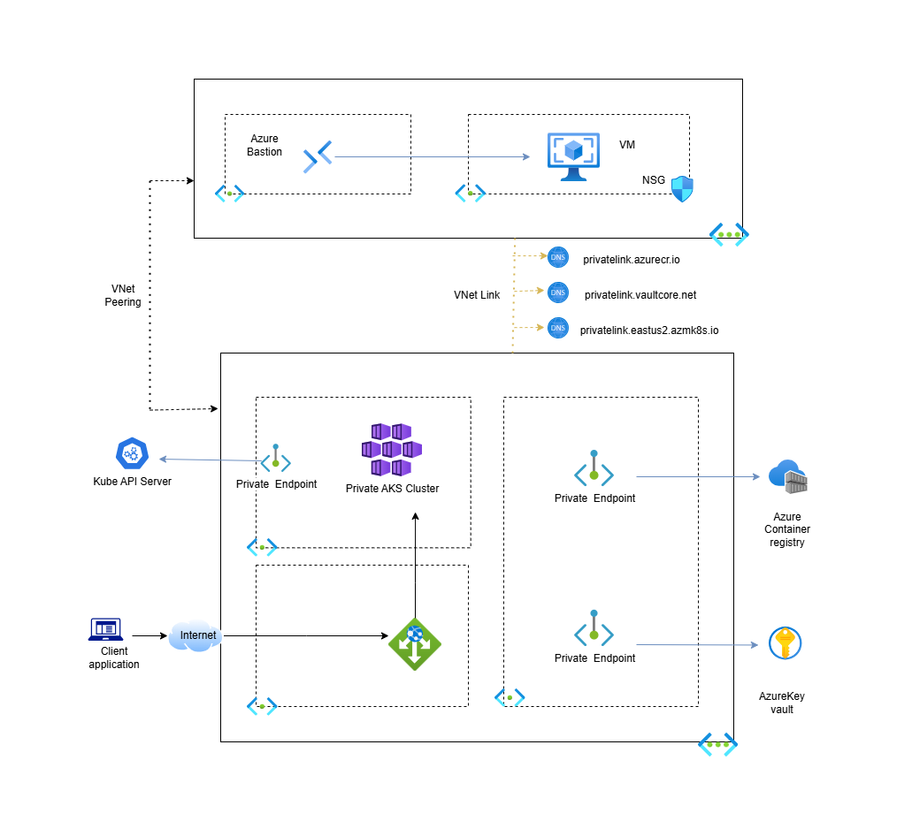

In this project, I  have documented a solution for automating the deployment of a private AKS Cluster that uses Azure Key Vault with Terraform.
# Overview of the Solution

## Resources to Be Created in Azure

- **2 Virtual Networks:** `vnet-hub` and `vnet-aks`
- **A Bastion**
- **A Virtual Machine** that will serve as jumpbox to access the private AKS  cluster
- **Container Registry** with a private endpoint to ensure private traffic
- **Container apps:** To be used as a Github Actions Self-hosted runner (since our container registry is private, we cannot use Github hosted runners)
- **Private DNS Zones:**
  - For the cluster: `privatelink.eastus2.azmk8s.io`
  - For the container registry: `privatelink.azurecr.io`
  - For the Key Vault: `privatelink.vaultcore.azure.net`
- **Application Gateway:**
  - Public IP address for internet-exposed applications
  - Private IP address for internally exposed applications
- **Key Vault** with a private endpoint to ensure private traffic
- **AKS Cluster** with 2 worker nodes

 
